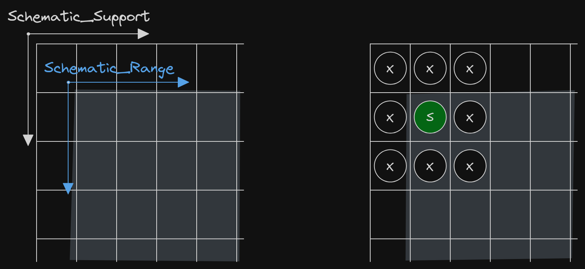
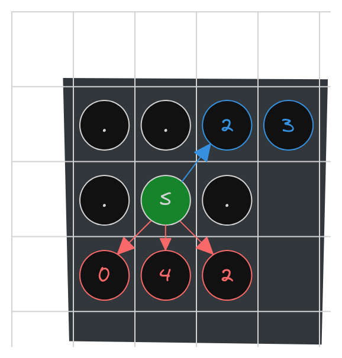

[](https://blog.adacore.com/announcing-advent-of-ada-2023-coding-for-a-cause)
[](https://forum.ada-lang.io/t/charity-advent-of-ada-spark-2023-submissions)

[](https://adventofcode.com/2023/day/3)
[](https://ada-lang.io/docs/arm)
[](https://alire.ada.dev/)


[](https://github.com/rocher/advent-of-code/blob/main/LICENSE)

##
# Advent of Code 2023 - Day 3

### Gear Rations

> The engineer explains that an engine part seems to be missing from the
> engine, but nobody can figure out which one. If you can add up all the part
> numbers in the engine schematic, it should be easy to work out which part is
> missing.

### Part 1
[](src/part_1.adb)

#### 2D Array

The main idea behind the algorithm implemented is:

  1. load the input file in a 2D array of `Character`
  2. for each position of the array
     * if that position is part of the engine, extract its part numbers and
       add them to the result

Extracting the part number of an engine component that is located at position
$(x,y)$ requires to examine whether there is a digit in each of the eight
adjacent positions or not. If so, then complete the part number with the
adjacent digits. The eight adjacent positions are located at position
$(x+\Delta x, y+\Delta y)$, $\forall\Delta x, \Delta y\in \lbrace-1, 0,
1\rbrace$ where $\Delta x\not=0$ and $\Delta y\not=0$.

This pattern of examining a 2D array must always take care of the array
boundaries when examining *edge* positions. To simplify the algorithm, at
the expense of more memory consumption, the array has been increased in two
rows and two columns:

  * `Schematic_Support` has been defined as a `Natural range 0 .. 141`
  * `Schematic_Range` is `Natural range 1 .. 140`

When a symbol $s$ is found in the `Schematic_Range` domain, all eight adjacent
positions will always exists, independently on where is it located:

<p align="center">
  <picture>
    <source media="(prefers-color-scheme: dark)" srcset="array-edges-dark.png">
    <source media="(prefers-color-scheme: light)" srcset="array-edges-light.png">
    
  </picture>
</p>


```ada
   subtype Schematic_Support is Natural range 0 .. 141;
   subtype Schematic_Range is Natural range 1 .. 140;

   type Schematic_Type is
     array (Schematic_Support, Schematic_Support) of Character;

   Schematic : Schematic_Type;
```

#### Avoid repetitions

Last thing to take into account is the *possible repetition* of part numbers.
This happens when a part number is located so that it is found in more than
one direction

<p align="center">
  <picture>
    <source media="(prefers-color-scheme: dark)" srcset="multiple-pn-dark.png">
    <source media="(prefers-color-scheme: light)" srcset="multiple-pn-light.png">
    
  </picture>
</p>

In the example, PN 23 is found only once when looking at position $(x-1,
y+1)$, but PN 42 is found when looking at the three indicated directions.

**Solution**: replace digits by dot characters `'.'` as soon as digit of a PN is
detected. This operation is called *Part Number Extraction*. Quite drastic,
right? But .. yeah!, with no requirements everything is valid :sunglasses:.

#### Putting it all together

The function that detects and returns the sum of all part numbers for a given
position is [Σ_Part_Numbers](src/part_1.adb#L24C1-L53C23).

### Part 2
[](src/part_2.adb)

#### *TITLE*
*TIP*

```ada
*EXAMPLE_OR_EXCERPT*
```

##
### License
MIT (c) 2023 Francesc Rocher
