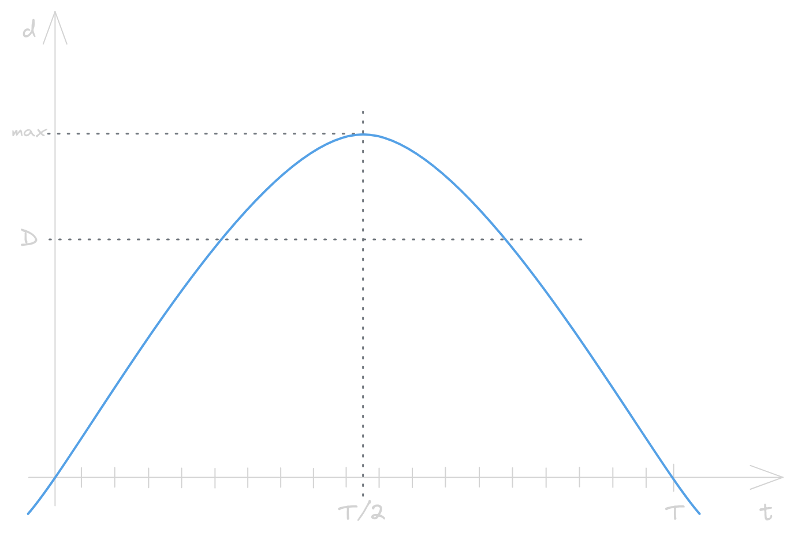
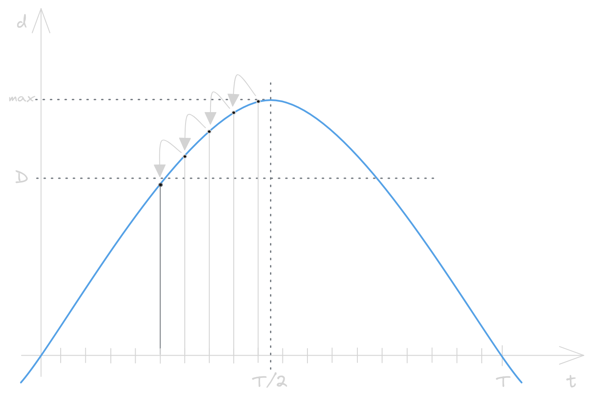

[](https://blog.adacore.com/announcing-advent-of-ada-2023-coding-for-a-cause)
[](https://forum.ada-lang.io/t/charity-advent-of-ada-spark-2023-submissions)

[](https://adventofcode.com/2023/day/6)
[](https://ada-lang.io/docs/arm)
[](https://alire.ada.dev/)


[](https://github.com/rocher/advent-of-code/blob/main/LICENSE)

##
# Advent of Code 2023 - Day 6

### Wait for it

> *Holding down the button charges the boat, and releasing the button allows
> the boat to move. Boats move faster if their button was held longer, but
> time spent holding the button counts against the total race time.*

### Part 1
[](src/part_1.adb)

#### Boat behavior

In a race that lasts $T$ milliseconds, $T-t$ is the time remaining time after
you press the button during $t$ milliseconds. The boat speed increases by one
millimeter per millisecond, so the final speed is $t\ \frac{mm}{ms}$. This
speed is kept during the remaining $(T-t)\ ms$, so the final distance
is

$$ d = f(t) = (T-t)\ ms \ \cdot \  t\ \frac{mm}{ms} = (T-t) \cdot t \ mm $$

This graph shows the function $f(t)$, the distance traveled by the boat
during $T-t$ milliseconds in a race that lasts $T$ milliseconds:

<p align="center">
   <picture>
     <source media="(prefers-color-scheme: dark)" srcset="img/function-dark.png">
     <source media="(prefers-color-scheme: light)" srcset="img/function-light.png">
     
   </picture>
</p>


#### Going down

Is easy to see that the maximum distance is reached at $t=T/2$; with the
derivative,

$$ \frac{df}{dt} = \frac{(T-t)\cdot t}{dt} = -2t+T = 0 \implies t = T/2 $$

To win a race, it is necessary to go further than the record distance $D$ for
that race. The number of ways to do it is the length of the interval, centered
at $T/2$, for which $f(t)\gt D$.

That's a good point to start an iterative algorithm: $t=T/2$. For the next
iterations, decrease $t$ by one, $t'=t-1$ and, if $f(t')\gt D$, then this is
another way to win the race. But count it twice! because the symmetry of the
function, $f(t+1)$ is also another way to win the race. Exit when $f(t')\lt D$.

Graphically:

<p align="center">
   <picture>
     <source media="(prefers-color-scheme: dark)" srcset="img/descent-dark.png">
     <source media="(prefers-color-scheme: light)" srcset="img/descent-light.png">
     
   </picture>
</p>

The only thing is to count the first point twice or not. If $T$ is even, count
it only once; otherwise count it twice:

```ada
   for Race of Races loop
      Count      : Natural := (if Race.Time mod 2 = 0 then 1 else 2);
      Press_Time : Natural := (Race.Time / 2) - 1;
      loop
         Count      := @ + 2;
         Press_Time := @ - 1;
         exit when (Race.Time - Press_Time) * Press_Time < Race.Distance;
      end loop;
      Answer := @ * Count;
   end loop;
```

### Part 2
[](src/part_2.adb)

#### Use `bc`

Lazy to implement the second part? Tired to read text files to manipulate
`Strings` in weird ways? Then simply use `bc` (*basic calculator*) with the
numbers given.

How?

The function $f(t)$ must be less than the race distance $D$:

$$ f(t) = (T-t)t < D $$

Solving $f(t)-D=0$,

$$ -t^2-Tt-D = 0 \implies t = \frac{T\pm\sqrt{T^2-4D}}{-2} $$

will give the value of $t'$ for which $f(t')\lt D$. Note that using the positive
value of the square root, $t'$ is in the right side of $T/2$.

The length of the interval $\left[T/2, t'\right]$ is:

$$ t'-\frac{T}{2} = \left( \frac{T+\sqrt{T^2-4D}}{2} - \frac{T}{2} \right) $$

This is half of the length, so the total length is two times this one:

$$ 2\left(t' - \frac{T}{2}\right) = \sqrt{T^2-4D}$$

Now, open your preferred calculator and substitute $T$ and $D$ with your
puzzle input.

##
### License
MIT (c) 2023 Francesc Rocher
